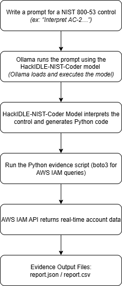

# AI Models for GRC Engineering: Translating NIST 800-53 Into AWS Evidence

This project demonstrates how AI models can translate compliance controls into actionable cloud evidence.

---

## Ollama & HackIDLE-NIST-Coder Basics

### What is Ollama?

Ollama is a engine that lets you run AI models locally on your own computer. Instead of sending data to a cloud AI service, Ollama loads the model directly onto your machine and runs everything privately and securely. 

When you type a question into Ollama, the AI model responds instantly (similar to ChatGPT), but all processing happens on your device.

### What is HackIDLE-NIST-Coder?

[HackIDLE-NIST-Coder Model](https://ollama.com/library/etgohome/hackidle-nist-coder) is an AI model trained specifically on cybersecurity topics and NIST frameworks.

Its purpose is to:
- understand NIST 800-53 controls
- explain what the controls mean
- translate the controls into technical steps
- generate Python scripts that collect the evidence needed for those controls

In other words: You give it a NIST control. It helps you write the cloud evidence script for that control.

This makes it useful for GRC practitioners who want to connect policy language to actual AWS evidence without becoming full-time developers.

### How They Work Together in This Project

You use Ollama to run the HackIDLE-NIST-Coder model.
The model reads a NIST control and generates a Python script designed to gather the AWS evidence required to support that control.

The workflow is simple:
1. You give the model a control
Example: “Interpret NIST AC-2 and write Python to list IAM users.”

2. The model generates Python code
It includes comments, reasoning, and understanding of the control.

3. You run the code
The script connects to AWS and produces real evidence.

4. You save the evidence
This becomes part of your audit or validation process.

---

## Logic Flowchart



---

## About This Project

This project shows how GRC engineering can use AI reasoning models and Python automation to bridge the gap between compliance frameworks and AWS environments.

Using the **HackIDLE-NIST-Coder** model in **Ollama**, NIST SP 800-53 controls are interpreted and translated into executable Python code that collects real-time compliance evidence from AWS IAM.

The result is a practical example of control automation specifically aligned with **NIST AC-2 (Account Management)** that shows how AI can operationalize compliance validation, reduce manual audit workload, and increase transparency between GRC teams and cloud environments.

---

## Tools & Setup

This project uses a combination of AI, Python automation, and AWS services to translate regulatory controls into actionable cloud evidence. Each component supports GRC engineering principles, control validation, and audit readiness.

| Tool / Component                             | Purpose & Value                                                                                         |
| -------------------------------------------- | ------------------------------------------------------------------------------------------------------- |
| **Ollama (AI engine/runtime)**               | Hosts and executes AI models locally, providing a secure environment for compliance queries.            |
| **HackIDLE-NIST-Coder**                      | AI model fine-tuned on NIST cybersecurity frameworks; generates Python scripts aligned with compliance controls. |
| **AWS Identity and Access Management (IAM)** | Source of cloud account data, used to verify access controls and account lifecycle management.          |
| **Python + boto3**                           | Enables programmatic interaction with AWS APIs for real-time evidence collection and automation.        |

---

## Step-by-Step Setup

**1.** Install Ollama
Ollama is a local AI engine that allows you to run models securely on your machine.
Follow the instructions for your operating system: https://ollama.com/download

**2.** Pull and run the AI model locally
```bash
ollama pull etgohome/hackidle-nist-coder
ollama run etgohome/hackidle-nist-coder
```
Example prompt inside Ollama:
```pgsql
>>> Generate a Python script using boto3 to list AWS IAM users.
>>> Include comments linking the purpose to NIST 800-53 AC-2 (Account Management).
```

**3.** Save the generated script locally
```bash
mkdir grc-iam-list-users
cd grc-iam-list-users
nano iam_list_users.py
```

Paste the Python code generated by the AI model into iam_list_users.py and save it.

**4.** Configure your AWS credentials

```bash
aws configure sso
```

Verify your credentials:
```bash
aws sts get-caller-identity --profile profilename
```

**5.** Run the script
```bash
python iam_list_users.py --profile profilename
```

Optional details mode:
```bash
python iam_list_users.py --profile profilename --details
```

---

## Example Output

When the script runs successfully, it produces a list of IAM users in your AWS account. Example:
```yaml
List of IAM Users:
annie.crane | ID: AIDAV2H00TS0BOJID0002 | ARN: arn:aws:iam::300066700000:user/annie.crane | Created: 2025-09-11 02:21:42
john.don   | ID: AIDAV2H00TS0BOJID0003 | ARN: arn:aws:iam::300066700000:user/john.don   | Created: 2025-09-10 14:17:09
...
```

This output provides real-time evidence of user accounts, supporting audits and control validation.

---

## NIST SP 800-53 Linkage

The script directly aligns with NIST AC-2 (Account Management).

| Control  | Title              | Purpose                                                       | How This Script Helps                                   |
| -------- | ------------------ | ------------------------------------------------------------- | ------------------------------------------------------- |
| **AC-2** | Account Management | Ensure accounts are created, managed, and removed per policy. | Lists all IAM users for visibility and control testing. |

> This approach demonstrates how AI-assisted automation can operationalize regulatory controls into actionable cloud evidence.

---

## GRC Insights

This project illustrates how GRC professionals can leverage AI and automation without becoming full-time developers:

- Speak the language of the cloud: Ask questions like “Who are my users?” programmatically.
- Verify compliance automatically: Transform NIST SP 800-53 requirements into executable Python scripts.
- Reduce manual audit workload: Quickly generate evidence and reports for auditors.
- Bridge gaps between GRC and engineering: Use automation to improve visibility, transparency, and control effectiveness.

> The combination of AI reasoning models, Python automation, and AWS APIs allows organizations to move from policy interpretation to data-driven compliance validation.

---

## Resources

- [Ollama](https://ollama.com/)  
- [HackIDLE-NIST-Coder Model](https://ollama.com/library/etgohome/hackidle-nist-coder)
- [NIST SP 800-53 Revision 5 (Official PDF)](https://nvlpubs.nist.gov/nistpubs/SpecialPublications/NIST.SP.800-53r5.pdf)  
- [AWS IAM Documentation](https://docs.aws.amazon.com/IAM/latest/UserGuide/introduction.html)

---
